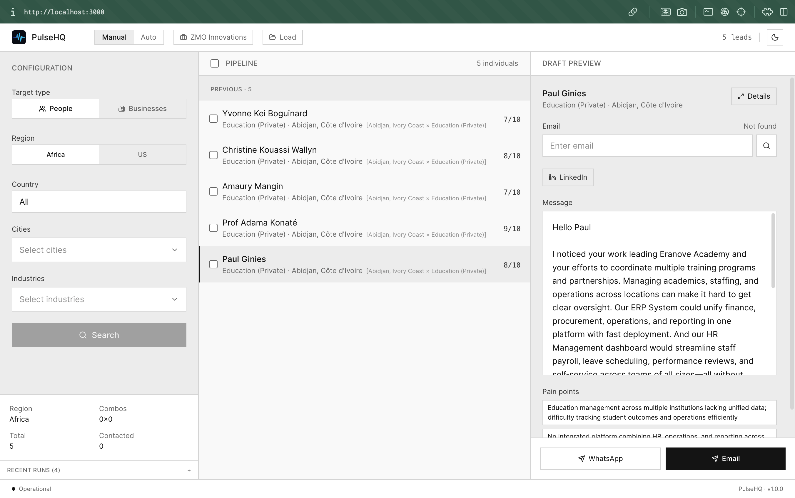
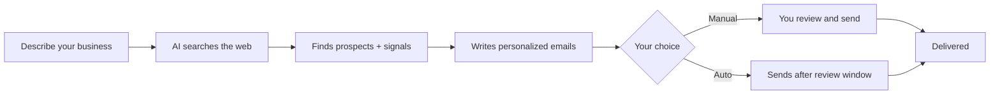
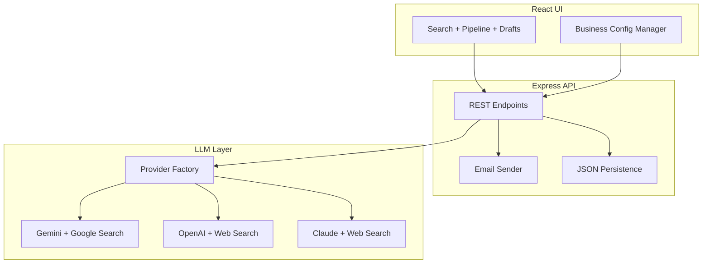
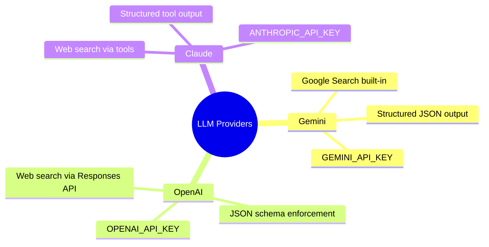
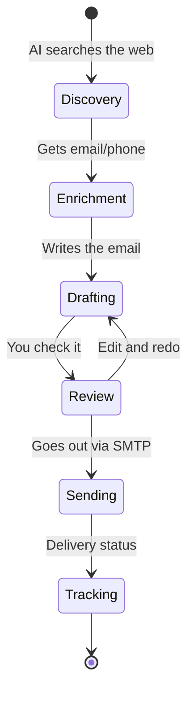
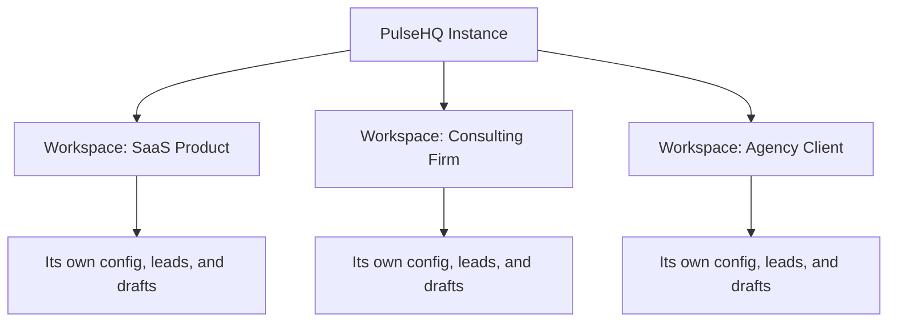

<div align="center">


### Find leads. Write emails. Close deals. All on autopilot.

[](LICENSE)
[](CONTRIBUTING.md)

[Get Started](#getting-started) · [How It Works](#how-it-works) · [Architecture](#architecture) · [Self-Host](#self-host) · [Contributing](#contributing)

</div>

---



## What is PulseHQ?

PulseHQ uses AI to find real prospects on the web, write emails that sound like you actually researched them, and send those emails for you.

No templates. No spreadsheets. No $5,000/mo tool stack.

```
Clay + Apollo + Instantly + a copywriter = PulseHQ (free, self-hosted)
```

---

## Features

- **AI Lead Discovery** - Finds businesses that match what you're looking for (industry, location, size)
- **Contact Enrichment** - Digs up emails and phone numbers automatically
- **Personalized Drafts** - Writes outreach based on real info about each prospect
- **SMTP Sending** - Sends emails straight from the app
- **Manual & Auto Modes** - Review everything yourself, or let it run hands-off
- **Multi-Provider** - Works with Gemini, OpenAI, or Claude. Switch with one env var.
- **Multi-Business** - Run different brands from one install
- **CSV Export** - Pull your leads out anytime
- **White-Label** - Rebrand it with env vars

---

## How It Works



Every email is based on real context about the person - their role, their company, what they're working on. Not `Hi {{first_name}}`.

---

## Getting Started

```bash
git clone https://github.com/zmoinnovations/PulseHQ.git
cd PulseHQ
npm install
cp .env.example .env   # add your LLM key
npm run dev            # open http://localhost:3000
```

Pick a provider. Add your key. Describe your business. Go.

---

## Architecture



### Providers



Set `LLM_PROVIDER=gemini|openai|claude` in `.env`. You only need the key for the one you pick.

---

## The Pipeline



### Manual vs Auto

- **Manual** - You pick who to contact, read every draft, hit send yourself.
- **Auto** - It runs on its own with a review window. You can stop it anytime.

---

## Self-Host

### You need

- Node.js 18+
- One LLM API key (Gemini, OpenAI, or Claude)
- SMTP credentials (only if you want to send emails)

### Environment Variables

```bash
# Pick one provider
LLM_PROVIDER=gemini
GEMINI_API_KEY=your-key

# For sending emails (optional)
SMTP_HOST=smtp.gmail.com
SMTP_PORT=587
SMTP_USER=you@gmail.com
SMTP_PASS=app-password
SMTP_FROM_EMAIL=you@gmail.com
SMTP_FROM_NAME=Your Name
```

### White-Label

Make it yours:

```bash
VITE_APP_NAME=YourBrand
VITE_APP_TAGLINE=Your tagline here
VITE_APP_LOGO_URL=/your-logo.svg
```

---

## Multi-Business Workspaces

Run multiple brands from one install. Each one is fully isolated.



Tell the AI who you are, what you sell, and how you talk. It handles the rest.

---

## Scripts

```bash
npm run dev       # Dev server (Express + Vite)
npm run build     # Production build
npm run preview   # Preview the build
npm run lint      # Type check
```

---

## Contributing

See [CONTRIBUTING.md](CONTRIBUTING.md). Issues and PRs welcome.

---

## License

[AGPL-3.0](LICENSE) - Copyright 2026 ZMO Innovations Ltd.

If you run PulseHQ as a service, you need to share your changes with your users.

---

<div align="center">

Built by [ZMO Innovations](https://zmoinnovations.com)

*Fork it. Plug in your business. Start closing.*

</div>
